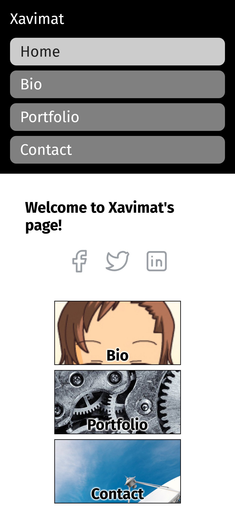
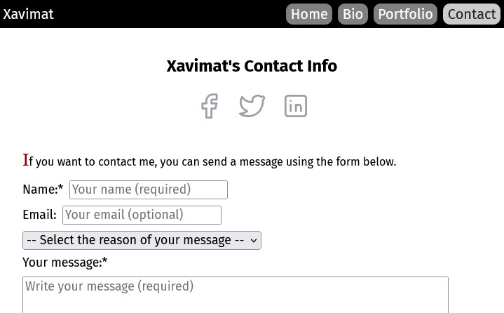
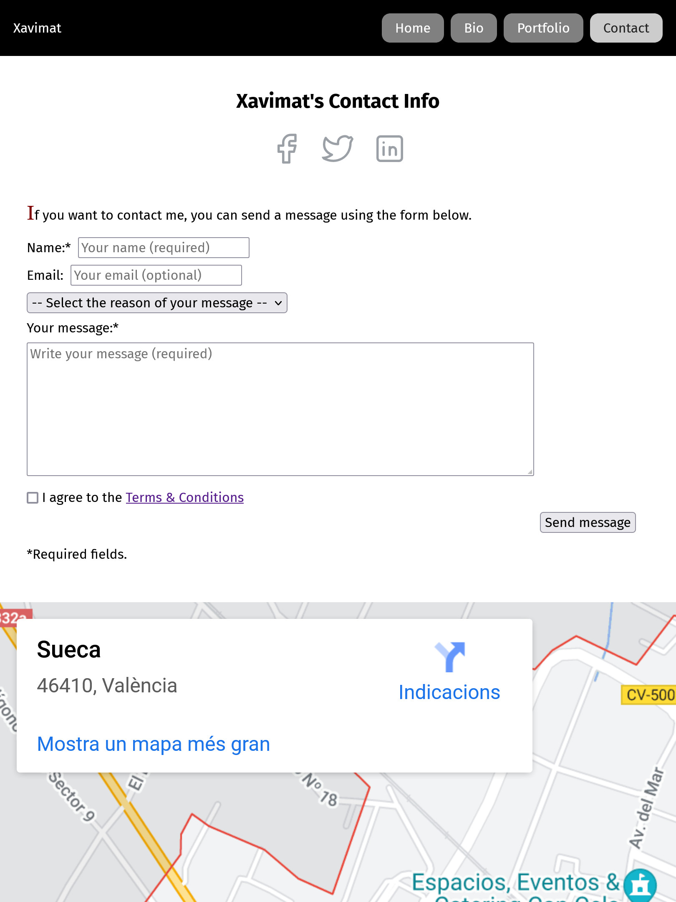
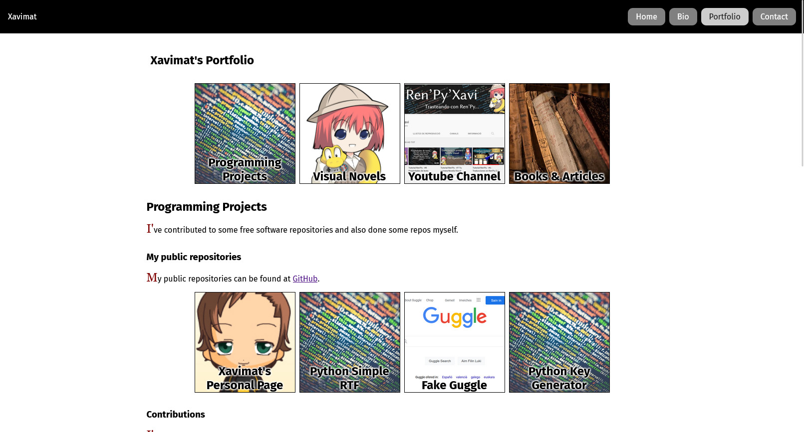

# boot007-mypage

Personal page project:

https://github.com/TheBridge-FullStackDeveloper/fswd-ft-abr22-ramp-up-valencia/blob/main/src/ejercicio/ejercicio-web-personal.md

## Screenshots

### Xsmall

### Small

### Medium

### Large

## Folder and files structure

### Pages:

- `index.html`
- `/pages`
- - `bio.html`
- - `contact.html`
- - `portfolio.html`

### Assets
- `/assets`
- - `/images`

## TODO

- [x] `nav` pattern
    - [x] `.html`
    - [x] `.css`
    - [x] `.js` No JS for now.
- [x] Content
    - [x] `index.html`
    - [x] `bio.html`
    - [x] `portfolio.html`
    - [x] `contact.html`
- [x] Styling
    - [x] `xsmall`
    - [x] `small`
    - [x] `medium`
    - [x] `large`
    - [x] `Xlarge`
- [x] Review
    - [x] `index.html`
    - [x] `bio.html`
    - [x] `portfolio.html`
    - [x] `contact.html`
    - [x] `styles.css`
- [x] Add a "go up" button
- [ ] Send
- [ ] All done!
